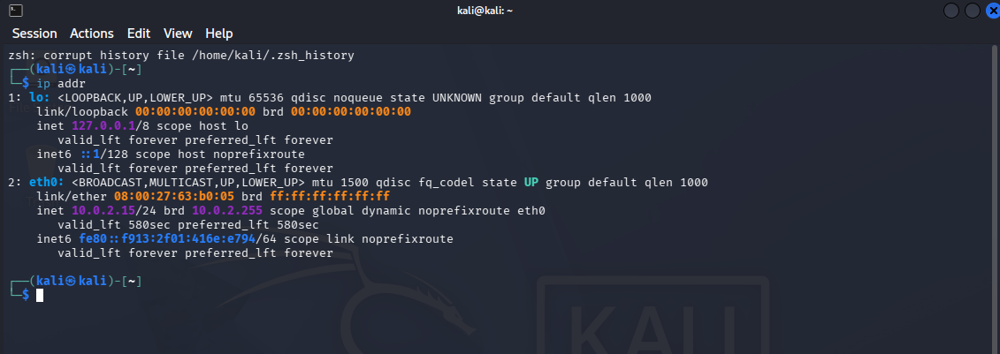
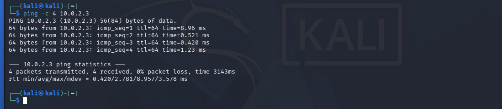
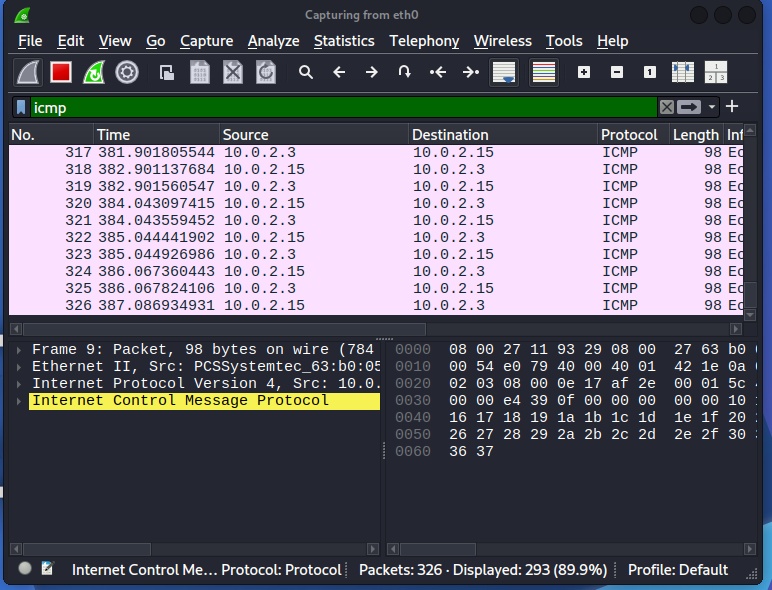
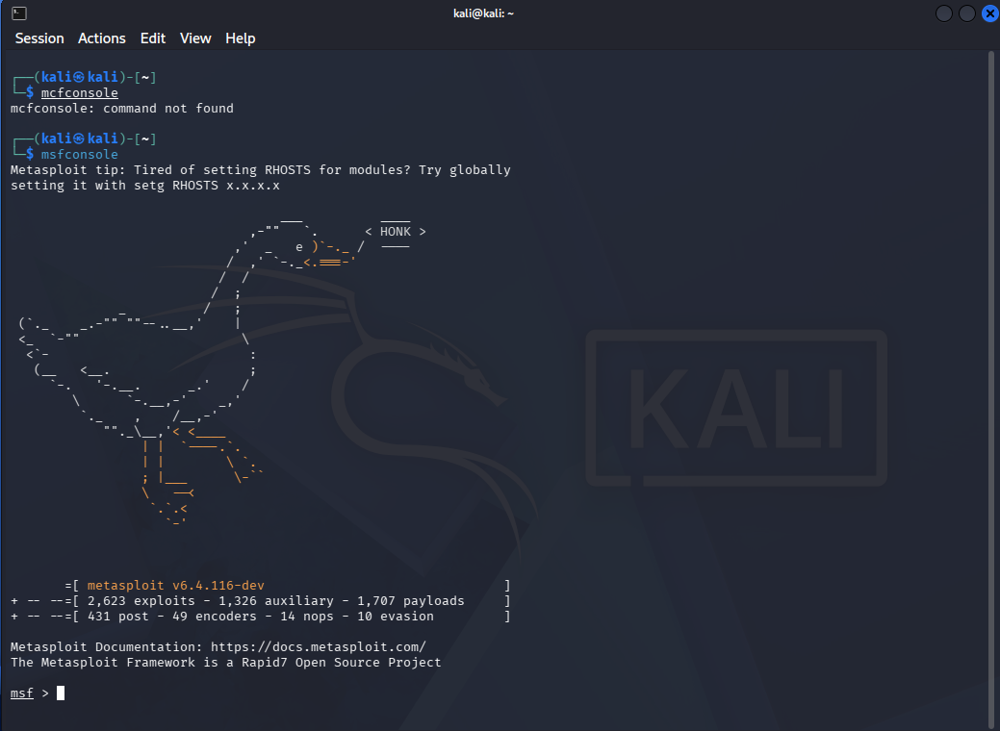

# Cybersecurity Portfolio & Home Labs

Welcome to my cybersecurity project repository. This space documents my hands-on experience and practical training as I prepare for the **CompTIA Security+ (SY0-701)** certification and transition into a Junior SOC Analyst role.

---

## 🛠️ Project 1: Isolated Detection & Exploitation Home Lab

### 📌 Project Overview
The goal of this project was to build a secure, fully isolated virtual environment to study network protocols, conduct vulnerability scanning, and analyze cyberattack traffic from a defender's perspective (Blue Team).

### 🖥️ Network Architecture
The infrastructure is built inside Oracle VM VirtualBox using an isolated NAT Network to prevent any vulnerable traffic from interacting with the host system or local home network.

| Machine | Operating System | Role | IP Address |
| :--- | :--- | :--- | :--- |
| **Kali Linux** | Debian (64-bit) | Attacker / Auditor | `10.0.2.15` |
| **Metasploitable 2** | Ubuntu (32-bit) | Vulnerable Target | `10.0.2.3` |

#### Network Diagram:

---

### 🚀 Hands-On Exercises Performed

#### 1. Network Interface Verification
Verified the local network configuration on the attacker machine to confirm proper connection to the `CyberLab` subnet.
- **Command used:** `ip addr`

#### 2. Network Connectivity Test (Ping)
Executed an ICMP connectivity test to verify communication between the attacker node and the target node, ensuring 0% packet loss.
- **Command used:** `ping -c 4 10.0.2.3`

#### 3. Network Reconnaissance & Vulnerability Scanning (Nmap)
Conducted deep scanning to identify active hosts, open ports, running services, and operating system versions.
- **Command used:** `nmap -sV -O 10.0.2.3`
- **Key findings:** Detected multiple high-risk open ports including FTP (21), SSH (22), and Telnet (23) running outdated software versions.

#### 4. Network Traffic Analysis (Wireshark)
Monitored and captured real-time network packets during the reconnaissance phase to analyze how automated scans and ping requests appear on the wire.
- **Applied Filter:** `icmp`
- **Key findings:** Captured precise `Echo (ping) request` and `Echo (ping) reply` sequences, demonstrating how basic network discovery alerts security logs.

#### 5. Framework Initialization (Metasploit)
Initialized the Metasploit Framework console to prepare for security auditing and basic exploitation exercises.
- **Command used:** `msfconsole`

---

### 🛡️ Defensive Conclusions & Hardening (SOC Insight)
From a security perspective, this exercise highlights the extreme danger of outdated software and weak credentials (`msfadmin/msfadmin`). 
In a corporate environment, the immediate remediation steps (hardening) would include:
1. **Patch Management:** Updating or replacing legacy systems like Metasploitable.
2. **Network Segmentation:** Implementing strict firewall rules to block unused ports (e.g., Telnet, FTP).
3. **Log Monitoring:** Forwarding system events to a SIEM (like **Wazuh** in upcoming projects) to detect unauthorized access instantly.
